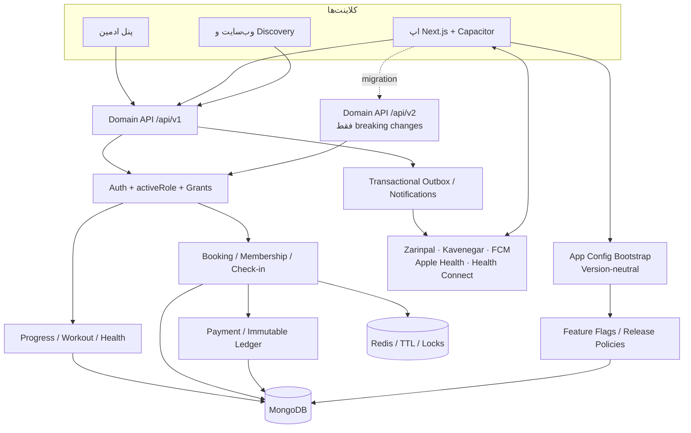
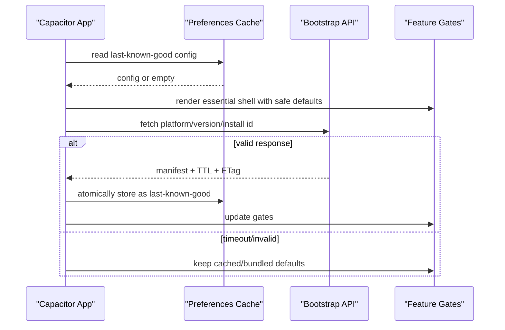

# معماری پیشنهادی Gym4Me برای موبایل، متریک و انتشار پویا

وضعیت: **پیشنهادی برای تصویب**  
نسخهٔ سند: `0.1`  
تاریخ: ۲۰۲۶-۰۸-۱۴  
مرجع محصول: [PRD جامع Gym4Me](./prd-gym4me.md)

> این معماری Expo را وارد پروژه نمی‌کند. اپ موجود Next.js + Capacitor حفظ می‌شود. موارد این سند تا زمان تصویب و پیاده‌سازی، وضعیت «پیشنهادی» دارند.

## ۱. پاسخ معماری در یک نگاه

- `apps/mobile`: همان Next.js static export داخل Capacitor برای Android/iOS.
- `apps/api`: NestJS + MongoDB/Mongoose و تنها منبع حقیقت دامنه.
- `packages/api`: قرارداد typed مشترک؛ اپ‌ها مستقیم URLهای پراکنده نمی‌سازند.
- `/api/v1`: قرارداد فعلی و سازگار؛ افزودن field/endpoint سازگار در همین نسخه.
- `/api/v2`: فقط برای breaking change واقعی و با بازهٔ مهاجرت.
- `/api/app-config/bootstrap`: endpoint عمومی و version-neutral با `schemaVersion` مستقل.
- Feature Flag: فعال‌سازی کد از قبل نصب‌شده، rollout و kill switch؛ نه مجوز امنیتی.
- Release Policy: حداقل/آخرین نسخه، update URL و API پیشنهادی per-platform/channel.
- Self Tracking: مدل sample عمومی و catalog-driven؛ نه collection جدا برای آب/خواب/پیاده‌روی.
- Health Sync: opt-in، idempotent، دارای source/cursor و قابل قطع.
- OTA: در فاز اول لازم نیست؛ اگر بعداً اضافه شد باید مخصوص Capacitor، امضاشده و تصمیم مستقل باشد.

## ۲. وضعیت و محدودیت‌های استک فعلی

| لایه | وضعیت فعلی | نتیجهٔ معماری |
|---|---|---|
| Mobile | Next.js production static export با `webDir: out` | قابلیت‌های وب/JS داخل binary قرار می‌گیرند |
| Native | Capacitor 7 برای Android/iOS | plugin/permission جدید به build مارکت نیاز دارد |
| API | NestJS URI versioning و global prefix `api` | مسیرهای دامنه اکنون `/api/v1/...` هستند |
| Data | MongoDB + Mongoose | مدل sample و config در MongoDB باقی می‌ماند |
| Shared client | `@repo/api` | DTO و endpoint باید از این پکیج منتشر شوند |
| Roles | JWT `activeRole` | authorization فقط بر اساس نقش فعال است |
| Privacy | `PRIVATE` پیش‌فرض | تمام queryها باید enforcement سمت سرور داشته باشند |

NestJS به‌صورت رسمی URI versioning، version در سطح controller/route و resource نسخه‌خنثی را پشتیبانی می‌کند؛ بنابراین bootstrap می‌تواند بدون `/v1` پایدار بماند: [NestJS Versioning](https://docs.nestjs.com/v10/techniques/versioning). Capacitor نیز برای حفظ web stack و دسترسی به APIهای بومی طراحی شده است: [Capacitor Documentation](https://capacitorjs.com/docs).

## ۳. نمای کلان سیستم



## ۴. مرزبندی ماژول‌ها

```text
apps/api/src/
  app-config/            # bootstrap، flags، release policy، audit
  progress/              # metric catalog/sample، goals، records، photos
  account/coaching/      # رابطه مربی-شاگرد، assessment، data grants
  account/bookings/      # رزرو و ظرفیت
  account/memberships/   # عضویت باشگاه/پلتفرم، جدا از هم
  finance/               # Payment، Ledger، refund، payout
  checkin/               # online/offline attendance
  notifications/        # inbox/push/SMS
  analytics/             # event و aggregate گزارش

packages/api/src/
  app-config/            # public bootstrap + admin config client
  progress/              # typed metric/workout/goal/grant client
  ...                    # سایر دامنه‌های موجود

apps/mobile/src/
  shared/providers/AppConfigProvider
  shared/lib/offline-queue/
  modules/athlete/self-tracking/
  modules/athlete/workout-session/
  modules/account/data-privacy/

apps/admin/src/
  modules/app-config/
  modules/releases/
```

قاعدهٔ وابستگی:

```text
UI → @repo/api → HTTP controller → domain service → Mongoose model
```

UI نباید مستقیماً Mongo shape یا URL نسخه را بداند. سرویس دامنه نباید تصمیم UI rollout را enforce کند؛ مجوز و policy امنیتی مستقل‌اند.

## ۵. چهار محور نسخه‌بندی

| محور | مثال | کاربرد | چه زمانی افزایش یابد؟ |
|---|---|---|---|
| App SemVer | `1.4.0` | نسخهٔ محصول نصب‌شده | feature قابل مشاهده/سازگاری |
| Native build | Android `42` / iOS `42` | انتشار مارکت | هر binary جدید |
| API version | `/api/v1` | قرارداد درخواست/پاسخ | فقط breaking change |
| Manifest schema | `schemaVersion: 1` | قرارداد bootstrap | تغییر ناسازگار manifest |

### قواعد API

#### در همان `v1` بماند

- endpoint جدید.
- field پاسخ جدید و optional.
- query optional جدید.
- enum جدید فقط وقتی کلاینت قدیمی unknown value را ایمن مدیریت می‌کند.
- بهبود validation که ورودی نامعتبر قبلی را رد می‌کند و قرارداد مستند را نمی‌شکند.

#### نیازمند `v2` است

- حذف یا تغییر نام field.
- تغییر معنا/واحد field موجود.
- mandatoryکردن field جدید برای همهٔ کلاینت‌ها.
- تغییر pagination envelope یا error contract.
- تغییر status lifecycle ناسازگار.
- تغییر semantics مالی یا privacy که کلاینت قدیمی اشتباه نمایش می‌دهد.

### چرخهٔ مهاجرت v1 به v2

```text
طراحی contract v2
→ اجرای dual controller/service adapter
→ contract tests برای v1 و v2
→ انتشار app دارای client v2 پشت flag
→ rollout تدریجی
→ اعلام deprecation/sunset
→ بررسی سهم ترافیک v1
→ پایان v1 فقط بعد از عبور از min app version
```

پیشنهاد: حداقل دو نسل API هم‌زمان پشتیبانی شوند و بازهٔ عادی sunset کمتر از شش ماه نباشد؛ رخداد امنیتی استثناست.

## ۶. معماری Bootstrap و Feature Flag

### endpoint

```http
GET /api/app-config/bootstrap
  ?platform=android
  &appVersion=1.4.0
  &buildNumber=42
  &channel=production
  &installationId=<opaque-id>
```

- controller با `VERSION_NEUTRAL` تعریف می‌شود.
- endpoint public است و هیچ secret یا دادهٔ کاربر برنمی‌گرداند.
- `installationId` شناسهٔ تصادفی اپ است، نه شماره موبایل یا device fingerprint.
- response با ETag و TTL کوتاه cache می‌شود.

### قرارداد پیشنهادی

```json
{
  "schemaVersion": 1,
  "serverTime": "2026-08-14T08:00:00.000Z",
  "cacheTtlSeconds": 300,
  "api": {
    "currentVersion": "1",
    "recommendedVersion": "1"
  },
  "compatibility": {
    "supported": true,
    "updateRequired": false,
    "updateAvailable": true,
    "minimumAppVersion": "1.2.0",
    "latestAppVersion": "1.5.0",
    "updateUrl": "https://gym4me.ir/download"
  },
  "features": {
    "athlete.self_tracking": {
      "enabled": true,
      "payload": { "metricKeys": ["water_ml", "steps", "sleep_duration_min"] }
    },
    "health.device_sync": {
      "enabled": false,
      "payload": {}
    }
  }
}
```

### مدل `FeatureFlag` پیشنهادی

```text
key: string unique
status: draft | active | paused | archived
defaultVariant: off | on | <variant-key>
rules[]:
  platforms[]
  channels[]
  minAppVersion?
  maxAppVersion?
  rolloutPercentage
  variant
payloadSchemaVersion
payload
ownerTeam
riskLevel: low | medium | high
expiresAt?
createdBy / updatedBy
```

به‌جای boolean ساده، status و variant امکان draft، pause، experiment و cleanup را می‌دهد و با قاعدهٔ شکل مدل دامنه سازگار است.

### assignment پایدار rollout

```text
bucket = hash(flagKey + installationId) % 100
enabled = bucket < rolloutPercentage
```

- bucket سمت سرور محاسبه شود تا همهٔ کلاینت‌ها نتیجهٔ یکسان بگیرند.
- assignment در طول rollout ثابت بماند.
- کاربر loginشده می‌تواند علاوه بر installation، subject ثابت داشته باشد؛ مهاجرت subject باید مستند شود.
- ۱۰۰٪ بدون installation id قابل فعال‌سازی است؛ rollout جزئی بدون id باید fail-closed باشد.

### نوع flag

| نوع | مثال | default قطعی شبکه |
|---|---|---|
| Release | `athlete.self_tracking` | آخرین config سالم، سپس bundled default |
| Kill switch | `payments.zarinpal` | fail-closed برای ایجاد پرداخت جدید |
| Ops config | `booking.payment_ttl_min` | default امن server-side |
| Experiment | `checkout.variant` | control |
| Permission | **ممنوع** | باید API authorization باشد |

### lifecycle اجباری flag

```text
draft → internal → beta → ramping → fully_on → cleanup → archived
                       ↘ paused / rolled_back
```

هر flag owner، تاریخ انقضا و ticket حذف داشته باشد؛ flag دائمی بدون owner به بدهی فنی تبدیل می‌شود.

## ۷. Release Policy و اجبار آپدیت

### مدل `MobileReleasePolicy`

```text
platform: ios | android | web
channel: production | beta | development
status: active | archived
latestAppVersion
minimumSupportedAppVersion
recommendedApiVersion
updateUrl
messageKey?
effectiveAt
createdBy / updatedBy
```

### تصمیم اپ

```text
appVersion < minimumSupported → blocking update
appVersion < latest           → optional update
otherwise                     → continue
```

اجبار آپدیت فقط در این موارد مجاز است:

- نقص امنیتی یا privacy.
- ناسازگاری API بعد از پایان migration.
- خرابی غیرقابل مهار با kill switch.
- الزام قانونی/درگاهی.

فیچر جدید معمولی نباید به forced update تبدیل شود.

## ۸. رفتار موبایل در startup و resume



### قواعد client

- config باید پیش از استفاده schema-validate شود.
- فقط response کامل و معتبر جای last-known-good را می‌گیرد.
- refresh در cold start، resume و پس از TTL انجام شود؛ نه روی هر صفحه.
- تغییر flag نباید فرم نیمه‌تمام را ناگهان حذف کند؛ effect روی navigation بعدی یا safe boundary اعمال شود.
- compatibility blocking از Feature Flag جدا باشد.
- payload فقط تنظیمات غیرحساس UI/رفتار است؛ token، key یا سیاست امنیتی محرمانه ممنوع.

## ۹. معماری دادهٔ Self Tracking

### اصل

یک collection عمومی sample داریم. `water_ml` یا `sleep_duration_min` نوع متریک‌اند، نه schema جدا. نوع، validation و aggregation در `MetricType` تعریف می‌شود.

### تقویت `MetricType`

| فیلد | هدف |
|---|---|
| `key` | شناسهٔ پایدار مانند `water_ml` |
| `valueKind` | number/pair/range/text |
| `canonicalUnit` | واحد ذخیره، مانند `ml`, `min`, `kg` |
| `validation` | min/max/step/integer |
| `aggregation` | latest/sum/average/min/max |
| `periodKind` | point/interval/daily-total |
| `sourceMappings` | شناسهٔ Apple Health/Health Connect |
| `display` | labelKey، iconKey، chartKind، sortHint |
| `privacyClass` | wellness/health/sensitive |
| `status` | draft/active/archived |

### تقویت `ProgressMetric`

```text
athleteUserId
metricKey
value
unit                 # canonical snapshot
recordedAt           # point or end of interval
period: { start?, end? }
source: manual | apple_health | health_connect | import
sourceRecordId?      # dedupe provider
clientMutationId?    # dedupe offline/manual retry
privacy              # default PRIVATE
note?
metadata?            # محدود و schema-validated
createdAt / updatedAt
```

Indexهای لازم:

```text
(athleteUserId, metricKey, recordedAt desc)
unique partial (athleteUserId, source, sourceRecordId)
unique partial (athleteUserId, clientMutationId)
```

### مدل‌های جدید پیشنهادی

#### `MetricGoal`

```text
athleteUserId
metricKey
target: { operator, value, unit }
period: daily | weekly | rolling_7d
effective: { start, end? }
status: active | paused | completed | archived
```

#### `MetricReminder`

```text
athleteUserId
metricKey
schedule: { timezone, weekdays[], localTime }
quietHours
channel: push | in_app
status: active | paused | archived
```

#### `AthleteDataGrant`

```text
athleteUserId
grantee: { type: coach, userId }
relationshipId: CoachStudent
scopes[]: metrics.weight | metrics.sleep | workouts.logs | progress.photos
effective: { grantedAt, expiresAt? }
status: active | revoked | expired
revokedAt / revokedBy
```

grant مکمل privacy است. `COACH_ONLY` به‌تنهایی مشخص نمی‌کند کدام مربی و کدام متریک مجاز است.

#### `HealthSyncState`

```text
athleteUserId
provider: apple_health | health_connect
status: connected | paused | disconnected | error
authorizedMetricKeys[]
cursorByMetric
lastSyncAt
lastErrorCode?
```

token/credential provider اگر وجود داشته باشد encrypted و خارج از manifest نگهداری شود.

## ۱۰. Workout Log هدف

مدل فعلی ست، تکرار، وزنه و RPE دارد؛ برای اجرای واقعی نیاز به lifecycle دارد:

```text
WorkoutSessionLog
  planId
  planRevisionId
  athleteId
  scheduledSessionRef
  status: draft | in_progress | completed | skipped | abandoned
  timing: { startedAt?, completedAt?, durationSec? }
  exerciseLogs[]
    exerciseId
    order
    sets[]
      reps?
      weightKg?
      durationSec?
      distanceM?
      rpe?
      status: completed | skipped
  pain: { score?, bodyAreaKeys[] }
  note?
  clientMutationId
  revision
```

قواعد:

- log به revision برنامه وصل شود تا تغییر بعدی مربی گذشته را عوض نکند.
- draft قابل resume و sync باشد.
- اصلاح log کامل‌شده با revision/audit انجام شود، نه overwrite بی‌سابقه.
- PR از دادهٔ log پیشنهاد می‌شود ولی ثبت/تأیید آن deterministic است.
- pain/health به‌صورت پیش‌فرض خصوصی و خارج از growth segmentation است.

## ۱۱. API پیشنهادی Progress

```http
# catalog
GET    /api/v1/account/progress/metric-types

# samples
GET    /api/v1/account/progress/metrics
POST   /api/v1/account/progress/metrics
PATCH  /api/v1/account/progress/metrics/:id
DELETE /api/v1/account/progress/metrics/:id
POST   /api/v1/account/progress/metrics/sync
GET    /api/v1/account/progress/metrics/summary

# goals/reminders
GET    /api/v1/account/progress/goals
POST   /api/v1/account/progress/goals
PATCH  /api/v1/account/progress/goals/:id
GET    /api/v1/account/progress/reminders
PUT    /api/v1/account/progress/reminders/:metricKey

# records/photos
GET    /api/v1/account/progress/personal-records
POST   /api/v1/account/progress/personal-records
GET    /api/v1/account/progress/photos
POST   /api/v1/account/progress/photos

# workout execution
POST   /api/v1/account/progress/workout-logs
PATCH  /api/v1/account/progress/workout-logs/:id
POST   /api/v1/account/progress/workout-logs/:id/complete

# grants/privacy
GET    /api/v1/account/data-grants
POST   /api/v1/account/data-grants
POST   /api/v1/account/data-grants/:id/revoke
```

### sync contract

```json
{
  "entries": [
    {
      "metricKey": "steps",
      "value": 8421,
      "unit": "count",
      "recordedAt": "2026-08-14T20:29:59.000Z",
      "periodStartAt": "2026-08-13T20:30:00.000Z",
      "periodEndAt": "2026-08-14T20:29:59.000Z",
      "source": "health_connect",
      "sourceRecordId": "provider-stable-id"
    }
  ]
}
```

پاسخ:

```json
{ "accepted": 1, "created": 1, "deduplicated": 0, "rejected": [] }
```

batch حداکثر، خطای per-item و retry-after باید مستند شوند.

## ۱۲. Health Connect و Apple Health

### جریان مجوز

1. flag و پشتیبانی platform بررسی می‌شود.
2. اپ قبل از prompt توضیح می‌دهد چه داده‌ای، چرا و با چه کسی استفاده می‌شود.
3. permission per-data-type درخواست می‌شود.
4. اولین sync فقط بازهٔ محدود و قابل توضیح را وارد می‌کند.
5. incremental sync با cursor و source id انجام می‌شود.
6. disconnect فوراً sync را متوقف می‌کند؛ حذف دادهٔ قبلی انتخاب جداست.

### نگاشت پیشنهادی

| منبع | MetricType canonical |
|---|---|
| steps | `steps` / `count` |
| walking distance | `walking_distance_km` / `km` |
| active duration | `walking_duration_min` / `min` |
| body mass | `weight_kg` / `kg` |
| sleep session | `sleep_duration_min` / `min` + interval |
| heart rate | `heart_rate_bpm` / `bpm` |

کیفیت خواب subjective از health provider استنتاج نشود مگر provider صریحاً score معتبر بدهد؛ self-report و device score source جدا دارند.

## ۱۳. Offline-first محدود

### قابل انجام آفلاین

- مشاهدهٔ آخرین برنامهٔ cacheشده.
- draft جلسهٔ تمرین.
- ثبت متریک، ست و یادداشت با `clientMutationId`.
- مشاهدهٔ وضعیت pending sync.

### غیرقابل انجام آفلاین

- پرداخت و ایجاد عضویت مالی.
- رزرو قطعی ظرفیت.
- تغییر grant حساس بدون تأیید سرور.
- پذیرش forced update override.

### صف sync

```text
queued → sending → synced
              ↘ retryable_error
              ↘ rejected_needs_user
```

- retry با exponential backoff و jitter.
- خطای validation به کاربر نمایش و بی‌نهایت retry نشود.
- logout صف کاربر قبلی را رمزگذاری/پاک‌سازی می‌کند؛ داده بین حساب‌ها نشت نمی‌کند.

## ۱۴. امنیت، privacy و authorization

- JWT `activeRole` تنها مبنای نقش جاری است.
- staff از permission grant per-member استفاده می‌کند.
- Feature Flag هیچ endpoint محافظت‌شده‌ای را مجاز نمی‌کند.
- هر query مربی، رابطهٔ فعال `CoachStudent` و `AthleteDataGrant` را query-time چک می‌کند.
- متریک، عکس، health assessment و meal plan پیش‌فرض `PRIVATE` هستند.
- تغییر privacy/grant و export/delete داده audit می‌شود.
- payload config از allowlist/schema عبور می‌کند و secret ندارد.
- rate limit جدا برای bootstrap، sync و export لازم است.
- logها نباید مقدار متریک سلامت، OTP، token یا payload حساس را ثبت کنند.
- دادهٔ مالی طبق Ledger حذف نمی‌شود؛ درخواست حذف حساب باید retention مالی را واضح توضیح دهد.

## ۱۵. Admin برای انتشار

### صفحهٔ Feature Flags

- جست‌وجو، status، owner، risk و expiry.
- platform/channel/version rules.
- rollout slider با preview تعداد subject.
- before/after diff و reason اجباری.
- pause/rollback یک‌کلیکی برای risk بالا.
- exposure/error/conversion per variant.

### صفحهٔ Release Policies

- ماتریس iOS/Android × production/beta.
- latest/minimum app version و update URL.
- نمایش سهم نسخه‌های فعال قبل از forced update.
- warning اگر minimum از درصد بزرگی از کاربران عبور می‌کند.

### مجوزهای ادمین پیشنهادی

```text
app_config.read
app_config.write
release_policy.read
release_policy.write
release_policy.force_update
```

برای forced update و kill switch پرریسک، تأیید دومرحله‌ای یا four-eyes policy پیشنهاد می‌شود.

## ۱۶. Observability و eventها

### eventهای release

```text
app_config_fetched
app_config_fetch_failed
feature_exposed
feature_action_completed
feature_action_failed
update_prompt_shown
forced_update_blocked
health_sync_started/completed/failed
metric_logged
workout_started/completed/abandoned
data_grant_created/revoked
```

envelope باید نسخه‌دار و idempotent باشد و شامل appVersion، build، apiVersion، platform، channel، flag variants و correlationId شود؛ دادهٔ سلامت خام وارد analytics عمومی نشود.

### SLOهای پیشنهادی

| سرویس | SLO اولیه |
|---|---|
| bootstrap availability | 99.95% |
| bootstrap p95 | کمتر از 300ms داخل ایران پس از CDN/cache |
| metric create p95 | کمتر از 500ms بدون media |
| sync duplicate rate | نزدیک صفر؛ قابل alert |
| config invalid response | صفر |
| revoke access propagation | فوری در درخواست بعدی |

## ۱۷. تست و دروازهٔ انتشار

### API

- unit: semver compare، rollout bucket، validation metric، privacy evaluator.
- contract: snapshot/OpenAPI برای v1 و v2.
- integration: dedupe sync، grant revoke، summary aggregation.
- concurrency: duplicate clientMutationId/sourceRecordId.
- security: activeRole، coach relationship، staff grants، log redaction.

### Mobile

- cold start با config سالم/خراب/timeout.
- cache migration و schema ناشناخته.
- offline queue، resume، logout و account switch.
- static export route coverage برای تمام screenهای pre-bundled.
- Android/iOS permission denied/partial/revoked.
- RTL، اعداد فارسی، تاریخ شمسی و timezone boundary.

### Admin

- role/permission، diff، audit و rollback.
- جلوگیری از rollout نامعتبر و minimum version اشتباه.

### rollout

```text
local → CI → staging → internal staff → beta 5%
→ 25% → 50% → 100% → cleanup flag
```

هر مرحله guardrail، owner و زمان مشاهدهٔ حداقل دارد.

## ۱۸. ترتیب پیاده‌سازی پیشنهادی

1. contract و مدل نسخهٔ release/config؛ بدون UI.
2. bootstrap read-only با bundled defaults و schema validation.
3. AppConfigProvider و gate روی یک قابلیت کم‌ریسک.
4. پنل admin + AuditLog + kill switch.
5. مدل کامل metric sample و sync idempotent.
6. UI ثبت دستی و offline queue.
7. workout session lifecycle و draft/resume.
8. data grants و coach view.
9. Health Connect/Apple Health incremental sync.
10. اهداف/reminder، telemetry و rollout عمومی.

## ۱۹. مواردی که عمداً انجام نمی‌دهیم

- استفاده از `/v2` به‌عنوان نام یک موج فیچر.
- دانلود کد دلخواه از manifest یا اجرای remote script.
- قراردادن secret یا permission در Feature Flag.
- حذف API v1 بلافاصله پس از انتشار v2.
- ذخیرهٔ فقط aggregate و از بین‌بردن sample خام.
- اشتراک کل پروندهٔ سلامت صرفاً با یک toggle مبهم.
- ورود Expo یا EAS Update به معماری فعلی.

